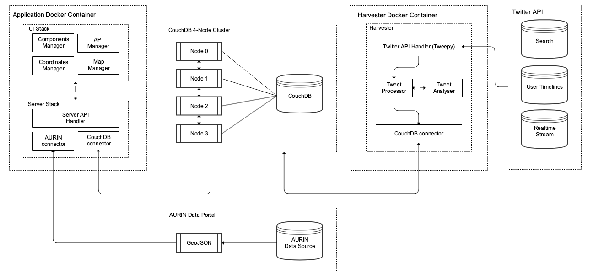
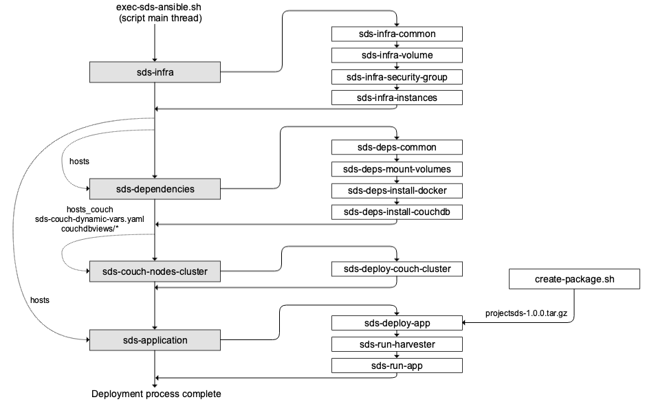
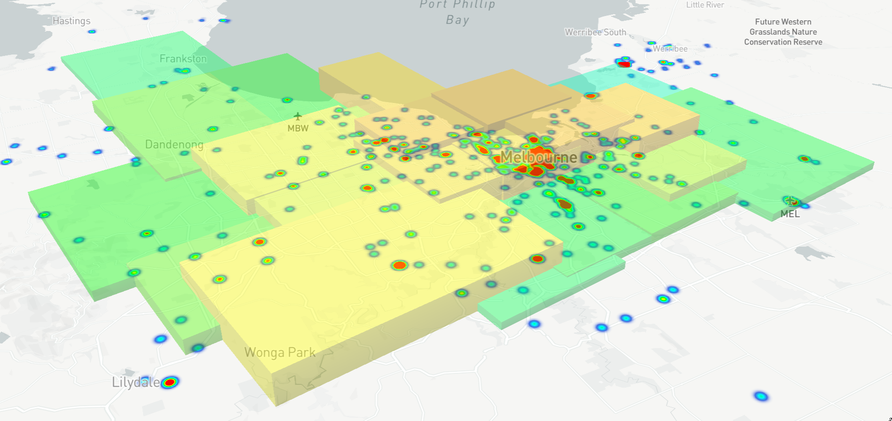
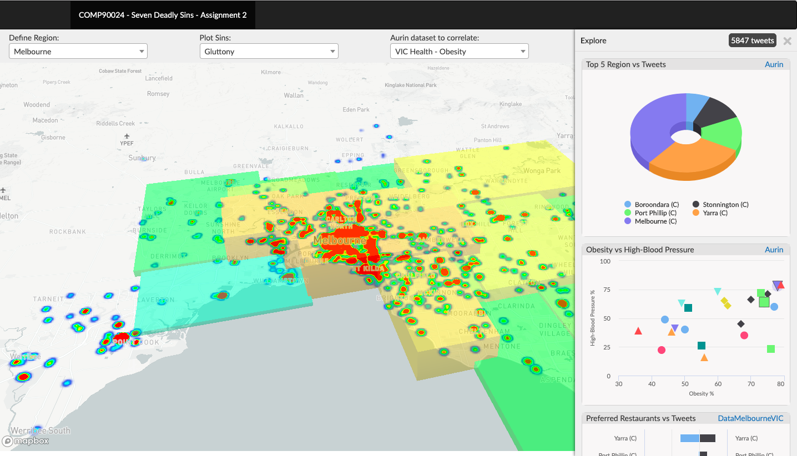
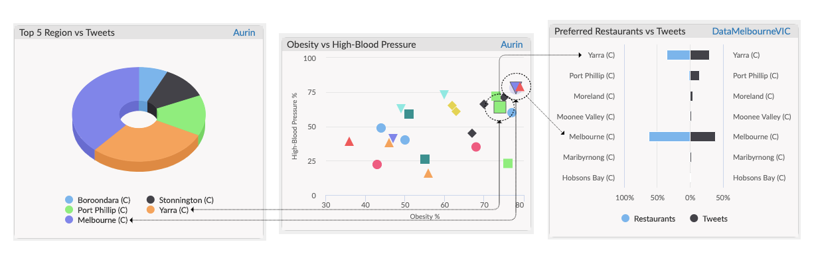

## ProjectSDS

### Abstract

To verify a story with AURIN, we extracted tweets related to gluttony
by searching for certain keywords in the text and correlated the number of
tweets on gluttony in certain areas of Melbourne with total number of
people having health issues. We were able to verify that the number of
tweets classified were proportional to the number of people having health
issues in those area.

### Prerequisities

- Ansible
- Linux Terminal
- Openstack cloud (Nectar)

### User Guide

This guide provides information on how developer can deploy our system and how users
can interact with the system to view and play around with the story.

#### Installation Guide

We have created installation module of this system with the goal of deploying entire
application with its infrastructure using single executable script. This project already
has the `.tar.gz` package created using `create-package.sh` due to which entire system
on the cloud can be deployed using following steps:

1. Install Ansible in the system using which cloud deployment will be performed.
2. Download `openrc.sh` file from dashboard of NeCTAR Research Cloud. It is also
recommended to generate API password by resetting it and saving it somewhere as
it will be prompted to enter by the script frequently.
3. Create key-pair on the NeCTAR cloud by uploading public key generated using
local machine.
4. Rename your private key to `cloud.key` and copy it with `openrc.sh` inside `ProjectSDS/deployment/sds-ansible/static/serverfiles`.
5. Open terminal at `ProjectSDS/deployment/sds-ansible` location and trigger following command to start
deployment: `sh exec-sds-ansible.sh`
6. The installation will ask for SUDO password and will prompt frequently to enter
openstack API password. After entire flow is completed,
application and harvester should be up and running.

#### User-Interface Guide

This guide explains the UI capability and features provided by the system by user can
perform several operations and visualize our scenarios.

• **Defining Regions.** User has the ability to filter desired region based on the area
on which visualization is required. Depending upon the region selected, map automatically select the desired region.

• **Selecting tweets filter.** UI provides the capability of selected filter on the
tweets based on the kind of correlation user want to see for sins with AURIN
dataset.

• **Selecting AURIN dataset.** User can selected desired AURIN dataset for visualizing correlation on the map with respect to the filter provided on the tweets.

• **Maps manipulations.** Maps can be easily manipulated by using basic mouse operations. It also provides the capability of visualizing AURIN dataset in heatmaps
with data interaction capabilities as explained in the report.

• **Exploring correlation.** UI also provides the capability of exploring correlation
with more in-depth analysis using visualizations. Using explore feature, user can
see how tweets of respective filter are relating with the selected AURIN dataset in
much more detailed mannner as explained in the report.

#### Useful Links

- **Application UI:** It is deployed on all 4 instances for minimizing downtime risk.
    1. [http://45.113.235.238:1313](http://45.113.235.238:1313)
    2. [http://45.113.235.186:1313](http://45.113.235.238:1313)
    3. [http://45.113.233.238:1313](http://45.113.235.238:1313)
    4. [http://45.113.233.242:1313](http://45.113.235.238:1313)
    
- **CouchDB Portal:** It is running on 4-node cluster setup.
    Username: `sdsadmin`, Password: `password`
    1. [http://45.113.235.238:5990/_utils](http://45.113.235.238:5990/_utils)
    2. [http://45.113.235.186:5990/_utils](http://45.113.235.238:5990/_utils)
    3. [http://45.113.233.238:5990/_utils](http://45.113.235.238:5990/_utils)
    4. [http://45.113.233.242:5990/_utils](http://45.113.235.238:5990/_utils)
    
- **Youtube Video Link:** [https://youtu.be/uUYbnlUWf6A](https://youtu.be/uUYbnlUWf6A)

- **Overleaf LaTeX Project Link:** [https://www.overleaf.com/read/wgdhystbbygt](https://www.overleaf.com/read/wgdhystbbygt)

### System Architecture

Our system architecture is designed with a thought-process of leveraging the power of
containerization and using CouchDB with AURIN in the most efficient manner. The
core components of the architecture are Application and Harvester, which are built
into docker images and ran in their individual docker containers as shown in below figure.

### Deployment Flow

Our aim is to deploy our entire application with its dependencies and infrastructure
using single executable script. This process of deploying using single executable script is
shown in below figure.

### The Final Story

We went through about 10 thousand tweets to understand the most frequent
words in the corpus. Interestingly, we saw that there were a large number of tweets that
revolved around keywords: ‘food’, ‘drink’, ‘cafe’, ‘restaurant’, etc. These tweets predominantly revolved around gluttony. We also came across a dataset in Local Government
Area (LGA) profiles data for VIC. This dataset contained the percentage of people having diabetes, high blood pressure, obesity and heart diseases in certain parts of victoria.
Since, most of the tweets were being harvested from Melbourne, we targeted only Melbourne. While extracting tweets on gluttony based on the above keywords, we were able
to get decent correlation between the ratio of tweets and the people having such diseases.

After completing our correlation, we were also presented with the ontology from Universidad Complutense de Madrid. However, due to limitation in time for submission, we
haven’t been able to explore our previous story line using the ontology. We plan to use
the ontology to complete our analysis in due time.

As we had many tries and a lot of code, we decided to merge only the used code. Not
used parts can be found in branches knezi-analyse and kabir-branch.

### Visualizations

Data is displayed on a map using mapbox-gl-js, which allows for easy consumption of
GeoJSON data, as well as highly customisable styling and complex data visualisation due
to the use of vector data and arbitrary WebGL layers. The map uses a light, low contrast
style Mapbox Light which provides a simple, distraction-free background on which to
display data, allowing the data visualisation to be the standout element.

Exploring feature helps in providing in-depth analysis of the story using various visualizations.
After tweets are plot on the map and corresponding data correlation set of AURIN is
selected, user can use explore module to get more analysis from the data which is plotted
on the map as shown in below figure.

As shown in the below figure, Melbourne and Yarra are the
regions where most of the gluttony tweets are found by the harvester using its analysis
engine. Comparing this information with scatter plot, it is also noticed that these regions
indeed have high patients of obesity and blood-pressure. Moreover, the assumption that
these regions will then have higher number of preferred restaurants is also seen by using
some other data source from DataMelbourneVic. Hence, exploration of data with these
visualization helped us to define a strong hypothesis for extracted gluttony tweets.

